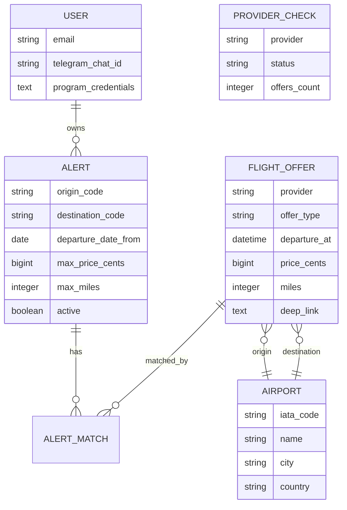

# FlightHunter — Requirements

> Ferramenta pessoal web para descobrir promoções de passagens aéreas (dinheiro e milhas/award) a partir de qualquer origem escolhida pelo usuário, com alertas automáticos para rotas e períodos de interesse.

## 1. Product overview

- **Problem:** Garimpar promoções de voos (pago) e disponibilidade award em programas de milhas é manual, disperso entre múltiplos sites, e perdido por não-monitoramento contínuo. Ofertas boas duram horas.
- **Users:** Owner único (o desenvolvedor). Sem cadastro público, sem multi-tenant.
- **Success metric:** Pelo menos uma notificação acionável (oferta que o usuário queira comprar ou investigar) por semana, vinda dos alertas configurados.
- **Out of scope for v1:**
  - Checkout/compra dentro do app (apenas redirect para a plataforma vendedora)
  - Cadastro público, signup, multi-usuário
  - Múltiplos passageiros complexos (default = 1 adulto, configurável no alerta)
  - Hotéis, carros, pacotes, seguro
  - App mobile nativo (web responsiva apenas; Telegram cobre o canal mobile)
  - Rotas com mais de 2 stops por perna
  - Comparação entre programas de milhas (valuations, cpm)
  - Email transacional

## 2. User roles

| Role | Can do | Cannot do |
|------|--------|-----------|
| Owner | Criar/editar/pausar/deletar alertas, executar buscas ad-hoc, gerenciar credenciais de programas, visualizar logs de provider | N/A — single-user |

## 3. Functional requirements

### 3.1 Core user journeys

**J1 — Busca ad-hoc**
- **Entry point:** Home logada, formulário de busca.
- **Steps:**
  - Usuário informa origem (digita aeroporto IATA ou cidade; autocomplete resolve ambos).
  - Usuário informa destino (mesma lógica).
  - Define tipo (só ida / ida e volta) e janela de datas (from/to para partida; idem para volta se round-trip).
  - Define classe (default economy) e número de passageiros (default 1).
  - Submete; sistema dispara jobs paralelos a todos os providers aplicáveis.
  - Turbo Stream atualiza a tela com ofertas conforme cada provider retorna.
- **Success state:** Lista unificada de `FlightOffer` (cash + award misturados, com filtros client-side: só pago / só award / por programa / por companhia / por número de stops), ordenável por preço, milhas, duração.
- **Edge cases:**
  - Nenhum resultado → mensagem clara + botão "criar alerta com esses critérios".
  - Provider falha → mostra os que retornaram, sinaliza quais falharam, não bloqueia.
  - Cache hit (busca igual em <30min) → resultados instantâneos com badge "cached".

**J2 — Criar alerta**
- **Entry point:** Botão "novo alerta" ou conversão a partir de uma busca vazia.
- **Steps:**
  - Formulário com os mesmos campos da busca + teto de preço (R$) e/ou teto de milhas.
  - Usuário salva; alerta vai para fila de checagem a cada 2h.
- **Success state:** Alerta listado em `/alerts` com status `active`, último check (null até primeira execução).
- **Edge cases:**
  - Limite de 10 alertas ativos → UI bloqueia criação, sugere pausar um existente.
  - Data de partida no passado → validação barra.
  - Sem teto nenhum configurado → validação exige pelo menos um (preço OU milhas).

**J3 — Gerenciar alertas**
- **Entry point:** Rota `/alerts`.
- **Steps:** Lista tabular com toggle ativo/pausado, edição inline (Turbo Frames), delete com confirm.
- **Success state:** Mudanças refletidas imediatamente; alertas pausados não rodam próximo ciclo.

**J4 — Click-out para plataforma vendedora**
- **Entry point:** Card de oferta em busca ou notificação Telegram.
- **Steps:** Clique no card → rota interna `/offers/:id/redirect` registra o clique e faz HTTP 302 para `deep_link` da oferta.
- **Success state:** Usuário aterrissa no site/app do provedor com a busca pré-preenchida quando possível.
- **Edge cases:** Link expirado → fallback para página de busca genérica do programa/companhia.

**J5 — Escolha de origem/destino**
- **Entry point:** Qualquer formulário com campo origem ou destino.
- **Steps:** Campo combobox com autocomplete sobre `Airport.iata_code`, `Airport.name`, `Airport.city`. Resultados mostram "FOR — Fortaleza, BR" ou "São Paulo (3 airports)".
- **Success state:** Valor selecionado guarda `origin_type` (airport/city) + `origin_code` (IATA ou nome canônico da cidade).
- **Edge cases:** Cidade sem aeroportos → não aparece no autocomplete.

### 3.2 Feature list

**Busca**
- **F-001:** Busca ad-hoc multi-provider — P0
- **F-002:** Autocomplete de origem/destino com resolução cidade↔aeroportos — P0
- **F-003:** Round-trip e one-way com janelas de data flexíveis — P0
- **F-004:** Cache de 30min por combinação (origem, destino, datas, classe, pax) — P0
- **F-005:** Filtros client-side: tipo (cash/award), stops, companhia, programa — P1
- **F-006:** Ordenação por preço, milhas, duração — P1

**Alertas**
- **F-010:** CRUD de alertas com limite de 10 ativos — P0
- **F-011:** Scheduler executando alertas ativos a cada 2h via Solid Queue — P0
- **F-012:** Matching de ofertas contra critérios (price ≤ max ou miles ≤ max) — P0
- **F-013:** Deduplicação de notificação via `AlertMatch` único — P0
- **F-014:** Pause/resume de alerta sem deletar — P1

**Providers**
- **F-020:** Adapter Duffel (cash) — P0
- **F-021:** Adapter Amadeus Self-Service (cash fallback) — P0
- **F-022:** Adapter seats.aero (award internacional) — P0
- **F-023:** Scraper Smiles (award BR) — P0
- **F-024:** Scraper Latam Pass (award BR) — P1
- **F-025:** Scraper TudoAzul (award BR) — P1
- **F-026:** Circuit breaker por provider com base em `ProviderCheck` — P1

**Notificações**
- **F-030:** Bot Telegram: notificação com preview rico (origem, destino, data, preço/milhas, link) — P0
- **F-031:** Comando `/alerts` no bot para listar alertas do dia — P2

**Ops**
- **F-040:** Dashboard interno `/admin` com saúde dos providers, últimas 24h de checks — P1
- **F-041:** Export CSV de ofertas históricas — P2

## 4. Non-functional requirements

- **Scale:** 1 usuário, até 10 alertas ativos, ~120 checagens/dia por provider ativo, ~1k ofertas persistidas por dia em pico.
- **Latency:** Busca ad-hoc best-effort (alguns providers levam 5-15s; UI atualiza progressivamente). Alertas rodam em background, sem target de latência.
- **Availability:** Best-effort. Downtime de horas é aceitável. Sem SLA.
- **Security:**
  - Auth: Rails `has_secure_password` + cookie session. Um único user seedado via credentials. Sem signup.
  - Credenciais de programas de milhas (Smiles/Latam Pass/TudoAzul) armazenadas encrypted via `ActiveRecord::Encryption` (Rails 8 nativo) em `User#program_credentials` (JSON).
  - Secrets (Duffel key, Amadeus key, seats.aero key, Telegram token, Telegram chat_id, Sentry DSN) em `Rails.application.credentials` (encrypted file commited).
  - HTTPS obrigatório em produção (Let's Encrypt via Kamal proxy).
- **Compliance:** N/A — single-user, sem PII de terceiros.
- **Accessibility:** WCAG AA básico (labels em forms, contraste Tailwind default). Não é foco.
- **i18n / l10n:** Português (Brasil). Moeda default BRL. Timezone `America/Fortaleza`. Sem necessidade de outros locales.

## 5. Tech stack (decided)

- **Frontend:** Hotwire (Turbo + Stimulus) + ViewComponent + Tailwind CSS via `tailwindcss-rails` (binário standalone). Import maps (sem Node no runtime).
- **Backend:** Ruby 3.3+ / Rails 8.0+. Monolito. Provider pattern para scraping/APIs externas, um job Solid Queue por provider.
- **Database:** SQLite 3 (WAL mode) — produção-ready em Rails 8 para single-user.
- **Auxiliares Rails 8 "solid" trio:** Solid Queue (background jobs), Solid Cache (cache de 30min em buscas), Solid Cable (Turbo Streams via WebSocket).
- **Hosting:** Hetzner VPS CX22 (€4.50/mês, 2 vCPU, 4GB RAM, 40GB SSD, Ubuntu 24.04). Deploy via Kamal 2.
- **CI/CD:** GitHub Actions — lint (RuboCop), specs (RSpec), depois deploy manual via `kamal deploy` a partir da máquina local.
- **Why this stack:**
  - Rails 8 + Solid trio elimina Redis/Postgres/Sidekiq — um único container, um volume SQLite, deploy trivial.
  - Hotwire + ViewComponent dá UI moderna sem SPA nem toolchain Node em produção.
  - Kamal é a ferramenta oficial Rails 8 para VPS — alinhamento total com o stack.

## 6. Third-party services (decided)

| Category | Service | Why | Account owner |
|----------|---------|-----|---------------|
| Cash fares (primário) | Duffel | Tier grátis generoso, API moderna, boa cobertura de companhias internacionais | Owner |
| Cash fares (fallback) | Amadeus Self-Service | 2000 calls/mês grátis, cobertura ampla, usado quando Duffel não tem a rota | Owner |
| Award fares (internacional) | seats.aero Partner API Basic (US$10/mês) | Cache-only, 500 req/dia, cobre United/AC/AA/Aeroplan/etc. | Owner |
| Award fares (BR) | Scraping próprio (Smiles, Latam Pass, TudoAzul) via Ferrum | Sem API pública viável | Owner |
| Notificações | Telegram Bot API | Grátis, ideal para notificação pessoal, rica (inline buttons) | Owner |
| Error monitoring | Sentry (tier grátis, 5k eventos/mês) | Captura exceptions e erros de scraping | Owner |
| Airport dataset | OurAirports CSV (domínio público) | Seedado no banco, sem API runtime, ~80k aeroportos | N/A (estático) |
| Browser headless | Ferrum (gem, Chrome via CDP) | Ruby puro, sem Selenium, usa Chromium instalado no container | Self-hosted |
| Auth | Rails `has_secure_password` + `ActiveRecord::Encryption` | Single-user, zero razão para serviço externo | N/A |
| Email | N/A — v1 não envia email | Telegram é o único canal | N/A |
| Payments | N/A — v1 não cobra nada | Uso pessoal | N/A |

**Custo mensal total estimado:** €4.50 (VPS) + US$10 (seats.aero) + US$0 (demais) ≈ **US$15/mês**.

## 7. External integrations

- **Integration:** Duffel API
  - **Direction:** out
  - **Mechanism:** REST (gem `duffel_api` ou HTTParty wrapper próprio)
  - **Data exchanged:** `offer_requests` com origem/destino/datas/pax → `offers` com itinerários
  - **Auth method:** Bearer token em header

- **Integration:** Amadeus Self-Service API
  - **Direction:** out
  - **Mechanism:** REST
  - **Data exchanged:** `/shopping/flight-offers` query params → offers JSON
  - **Auth method:** OAuth2 client credentials (access token cacheado)

- **Integration:** seats.aero Partner API
  - **Direction:** out
  - **Mechanism:** REST
  - **Data exchanged:** query `origin`/`destination`/`cabin`/`start_date`/`end_date` → availability por programa
  - **Auth method:** `Partner-Authorization` header com API key

- **Integration:** Smiles / Latam Pass / TudoAzul (scraping)
  - **Direction:** out (leitura)
  - **Mechanism:** Ferrum (Chrome headless CDP) — navega pela página de busca award, extrai DOM
  - **Data exchanged:** Origem, destino, datas → oferta parseada (milhas, taxas, companhia, horário)
  - **Auth method:** Login com credenciais pessoais (guardadas encrypted) quando necessário; muitas páginas permitem busca anônima

- **Integration:** Telegram Bot API
  - **Direction:** bidirecional (envia notificações, recebe comandos)
  - **Mechanism:** gem `telegram-bot-ruby`, long polling em worker dedicado (OU webhook se quiser simplificar — long polling evita expor endpoint)
  - **Data exchanged:** `sendMessage` com parse_mode=Markdown e inline keyboard; recebe `/alerts`, `/pause`, etc.
  - **Auth method:** Bot token

- **Integration:** Sentry
  - **Direction:** out
  - **Mechanism:** gem `sentry-ruby` + `sentry-rails`
  - **Data exchanged:** Exceptions, breadcrumbs, contexto de request/job
  - **Auth method:** DSN em credentials

## 8. Data model

### 8.1 Entities

**`User`** — usuário owner. Single-user seedado no primeiro deploy.
- `id` (bigint, PK)
- `email` (string, unique, not null)
- `password_digest` (string, not null)
- `telegram_chat_id` (string, nullable — preenchido após primeiro `/start` no bot)
- `program_credentials` (encrypted text, JSON — `{"smiles": {...}, "latam_pass": {...}}`)
- `created_at`, `updated_at`
- **Indexes:** `email` unique.

**`Airport`** — seed do OurAirports.
- `id` (bigint, PK)
- `iata_code` (string, 3 chars, nullable — nem todo aeroporto tem IATA)
- `icao_code` (string, 4 chars, nullable)
- `name` (string, not null)
- `city` (string, nullable)
- `country` (string, 2 chars ISO, not null)
- `latitude` (float), `longitude` (float)
- `timezone` (string)
- `airport_type` (string — `large_airport`, `medium_airport`, etc.)
- `created_at`, `updated_at`
- **Indexes:** `iata_code` unique partial (where not null), `city`, `country`.

**`Alert`** — critérios de monitoramento.
- `id` (bigint, PK)
- `user_id` (FK, not null)
- `origin_type` (string enum: `airport`/`city`, not null)
- `origin_code` (string, not null — IATA se airport, nome canônico se city)
- `destination_type` (string enum: `airport`/`city`, not null)
- `destination_code` (string, not null)
- `trip_type` (string enum: `one_way`/`round_trip`, not null)
- `departure_date_from` (date, not null)
- `departure_date_to` (date, not null)
- `return_date_from` (date, nullable)
- `return_date_to` (date, nullable)
- `cabin_class` (string enum: `economy`/`premium_economy`/`business`/`first`, default `economy`)
- `passengers` (integer, default 1)
- `max_price_cents` (bigint, nullable)
- `max_miles` (integer, nullable)
- `currency` (string, 3 chars ISO, default `BRL`)
- `active` (boolean, default true, not null)
- `last_checked_at` (datetime, nullable)
- `created_at`, `updated_at`
- **Indexes:** `user_id`, `active + last_checked_at` composto (query principal do scheduler).
- **Validations:** pelo menos um de `max_price_cents` ou `max_miles` presente; `round_trip` exige datas de volta; owner tem ≤ 10 `active: true`.

**`FlightOffer`** — oferta encontrada (cash ou award).
- `id` (bigint, PK)
- `provider` (string enum, not null: `duffel`/`amadeus`/`seats_aero`/`smiles`/`latam_pass`/`tudoazul`)
- `offer_type` (string enum: `cash`/`award`, not null)
- `origin_airport_id` (FK Airport, not null)
- `destination_airport_id` (FK Airport, not null)
- `departure_at` (datetime, not null)
- `arrival_at` (datetime, not null)
- `return_departure_at` (datetime, nullable)
- `return_arrival_at` (datetime, nullable)
- `airline_iata` (string, 2-3 chars — companhia principal)
- `flight_numbers` (text, JSON array — ex `["AD2716","AD4562"]`)
- `stops` (integer, not null, default 0)
- `cabin_class` (string enum)
- `price_cents` (bigint, nullable — para cash)
- `currency` (string, 3 chars, nullable)
- `miles` (integer, nullable — para award)
- `taxes_cents` (bigint, nullable — taxas em award)
- `program` (string, nullable — `smiles`/`latam_pass`/`united`/etc. para award)
- `deep_link` (text, not null)
- `raw_payload` (text, JSON — response cru do provider)
- `found_at` (datetime, not null)
- `expires_at` (datetime, nullable)
- `created_at`, `updated_at`
- **Indexes:** `(origin_airport_id, destination_airport_id, departure_at)`, `provider`, `found_at`, `expires_at`.

**`AlertMatch`** — join dedupe.
- `id` (bigint, PK)
- `alert_id` (FK, not null)
- `flight_offer_id` (FK, not null)
- `notified_at` (datetime, nullable)
- `created_at`, `updated_at`
- **Indexes:** `(alert_id, flight_offer_id)` unique.

**`ProviderCheck`** — log operacional.
- `id` (bigint, PK)
- `provider` (string, not null)
- `origin_code` (string)
- `destination_code` (string)
- `status` (string enum: `success`/`failure`/`rate_limited`, not null)
- `error_message` (text, nullable)
- `offers_count` (integer, default 0)
- `duration_ms` (integer)
- `ran_at` (datetime, not null)
- `created_at`, `updated_at`
- **Indexes:** `(provider, ran_at)`, `status`.

### 8.2 Relationships

Cidade→aeroportos é derivado on-the-fly via `Airport.where(city: 'São Paulo', country: 'BR')` — sem tabela `CityAlias`.

### 8.3 Tenancy model

Single-tenant. Não há `tenant_id`. `User` existe para auth e para ancorar `Alert.user_id`, mas há apenas um registro.

### 8.4 Data handling notes

- **Soft deletes:** nenhum. `Alert.active = false` substitui soft-delete para pausar; `destroy` é hard.
- **Audit trails:** `ProviderCheck` serve como audit de execuções. `AlertMatch.notified_at` audita notificações enviadas.
- **PII:** `User.email` e `User.program_credentials`. Credenciais encriptadas via `ActiveRecord::Encryption` com deterministic=false. Email em plaintext (single-user, uso pessoal).
- **Encryption at rest:** SQLite file em volume Hetzner; volume criptografado no nível do filesystem (LUKS opcional) ou sem crypto (aceitável para dados não-sensíveis). `program_credentials` sempre encrypted no app-layer independente disso.
- **Retenção:** job noturno (`Cleanup::ExpiredOffersJob`) deleta `FlightOffer` onde `expires_at < 30.days.ago`. `ProviderCheck` deletado após 90 dias. `AlertMatch` segue o ciclo de vida do `FlightOffer` (cascade delete).
- **Backups:** `litestream` replicando SQLite para Backblaze B2 ou S3 (opcional; custo mínimo). Alternativa simples: cronjob `sqlite3 .backup` + `rsync` para pasta separada no mesmo VPS, restaurável manualmente.

## 9. Environments

- **Local dev:** `bin/dev` (Procfile.dev com rails server, solid_queue worker, tailwindcss watch, telegram bot worker). SQLite em `db/development.sqlite3`. Credentials locais via `bin/rails credentials:edit -e development`. VCR cassettes em `spec/cassettes`.
- **Staging:** N/A — single-user, projeto pessoal. Mudanças arriscadas testam em local contra dados de produção clonados.
- **Production:** Hetzner VPS. URL pessoal (ex: `flights.seudominio.com`). Deploy via `kamal deploy`. SQLite em volume persistente `/var/lib/flighthunter/db`. Credentials via `RAILS_MASTER_KEY` em secrets do Kamal.
- **Seed/fixture strategy:**
  - `db/seeds.rb` roda `OurAirports::Importer` (baixa CSV uma vez, popula `airports`).
  - Cria `User` único a partir de `ENV['OWNER_EMAIL']` e `ENV['OWNER_PASSWORD']` (passados via Kamal secrets no primeiro deploy).
  - Specs usam `factory_bot` com airports fixture reduzido (50 aeroportos principais) carregado via `spec/support/airports_fixture.rb`.

## 10. Open questions

- **Webhook vs long-polling do Telegram:** Long polling assumido por simplicidade (um worker rodando `getUpdates`). Se quiser economizar processo, trocar por webhook exige HTTPS público (já teremos via Kamal). **Default: long polling.** Revisitar se comer CPU demais.
- **Quais programas BR priorizar na ordem de implementação:** Smiles é o mais pedido; Latam Pass tem integração mais fácil via GraphQL público. TudoAzul é o mais difícil (Cloudflare agressivo). **Default: Smiles → Latam Pass → TudoAzul nessa ordem, aceitando que TudoAzul pode ficar como P2.**
- **Litestream para backup:** adiciona ~US$1/mês em egress/storage. **Default: deferir para pós-v1; usar cronjob local de backup até então.**
